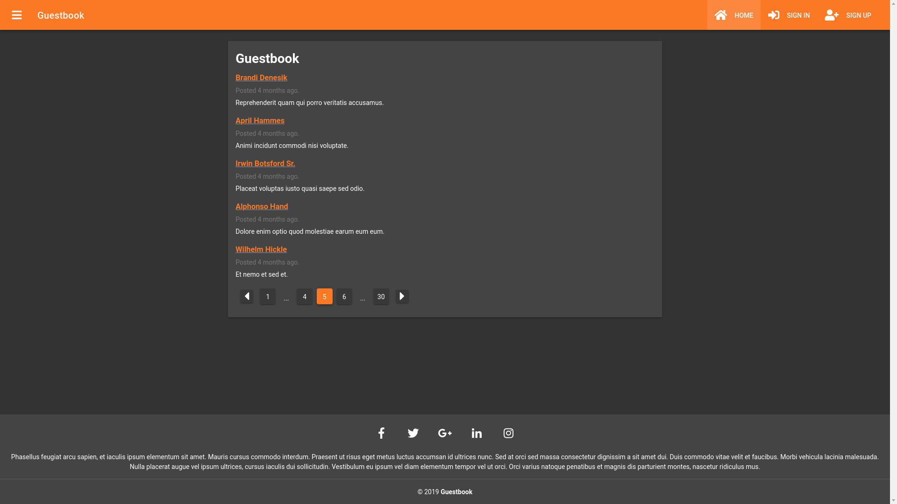

# Guestbook

This is a mini web app and based on the guestbook. It was used to create the app: laravel framework, vue.js, and mySql.

## Installation

-   `git clone https://github.com/risticdejan/guestbook.git`
-   `cd guestbook`
-   Create a database and inform _.env_ (create this file as .env.example)
-   `composer install`
-   `php artisan key:generate`
-   `php artisan migrate --seed` to create and populate tables
-   `php artisan vendor:publish --provider="Tymon\JWTAuth\Providers\LaravelServiceProvider"`
-   `npm install` to download npm packages
-   `npm run prod`

## Look what it looks like

## License

The Laravel framework is open-source software licensed under the [MIT license](https://opensource.org/licenses/MIT).
